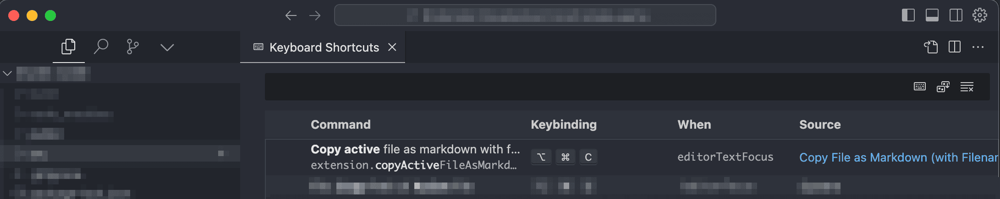

# Copy File as Markdown for VS Code

A Visual Studio Code extension that allows you to copy selected files in the Explorer as markdown with filename to the clipboard.

The extension is particularly useful for quickly and easily exporting multiple files with paths for LLMs like ChatGPT or Claude (if you do not use an AI coding integration/editor like [Cursor](https://www.cursor.com/) or [GitHub Copilot](https://github.com/features/copilot)).

## Features

- **Copy as Markdown**: Easily copy the content of selected files or folders as markdown with filename to the clipboard.
- **Context Menu**: Right-click on files, multiple selected files, or folders in the Explorer to access the "Copy as markdown with filename" option.

## Usage

1. **Install the Extension**:
    - Search for "Copy File as Markdown for VS Code" in the [Visual Studio Code Marketplace](https://marketplace.visualstudio.com/VSCode).
    - Click \`Install\` to add the extension to your VS Code environment.

2. **Use the Extension**:

    **Copy open file content as markdown:**

    - To copy the content of the currently open file in the editor along with its filename in markdown format, use the keyboard shortcut `alt+cmd+c`.

    **Copy selected file(s) as Markdown:**

    - Open the Explorer view in VS Code.
    - Right-click on a file, multiple selected files, or a folder.
    - Select `Copy as markdown with filename` from the context menu to copy the file paths as markdown.

    

## Configuration

- Change the keyboard shortcut for Copy open file content as markdown" 

## License

This project is licensed under the [MIT License](LICENSE.md).

Thank you for using and contributing to the extension!
